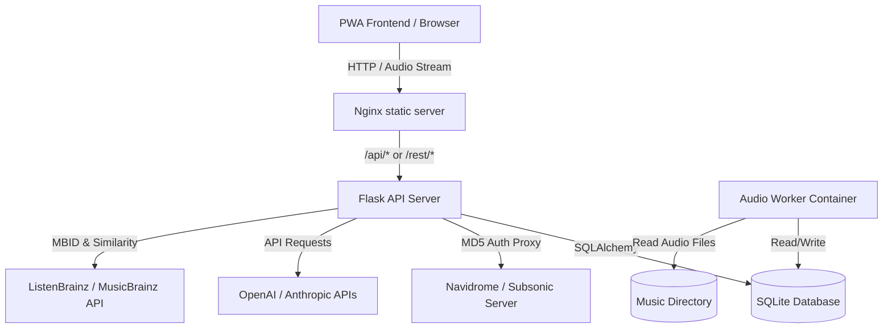

# Orbit 🪐

<p align="center">
  
</p>

Orbit is a self-hosted client and recommendation server for Subsonic/Navidrome music libraries. It maintains a continuous rolling queue of upcoming tracks by blending listening history, skips, and user feedback through either local acoustic analysis or cloud-based LLM APIs.

The frontend is a mobile-friendly Progressive Web App (PWA) with lock-screen integration, background audio pre-fetching, and real-time station diagnostics.

---

## System Architecture



### Components
1. **`orbit-frontend`**: React, TypeScript, and Vite built static bundle served via Nginx. It manages audio playback using the browser's HTML5 Audio API, handles lock-screen controls via the Media Session API, and handles track pre-fetching. It also acts as the primary reverse proxy, forwarding `/api` and `/rest` requests to the backend.
2. **`orbit-backend`**: Flask server executing the API factory pattern. It proxies audio streams, acts as a credential shield, manages the SQLite database, and handles query scheduling.
3. **`orbit-worker`**: Background worker running a loop to analyze raw audio files. It uses CPU-limited thread operations to generate vector embeddings.

---

## Features

### 1. Dual Recommendation Modes
You can toggle between two curating backends inside the client interface:
- **Cloud AI DJ (LLM-Driven)**: Generates a natural language music profile based on your history. It passes candidate metadata pools to OpenAI (`gpt-4o-mini`) or Anthropic (`claude-3-5-haiku`) to return the next 5 tracks along with a personalized sentence explaining why each was chosen.
- **Local Engine (Hybrid Math)**: Runs completely self-hosted with zero API cost. It grades candidates using a weighted scoring model:
  - **Acoustic Similarity (40%)**: Cosine similarity of 27-dimensional feature vectors (Tempo/BPM, key profile, spectral flux energy, and timbral MFCC texture) extracted over the middle 30 seconds of your audio files.
  - **Metadata Mapping (30%)**: Scores matches on genres (+0.5), artists (+0.3), and BPM proximity (+0.2).
  - **Community Graphing (20%)**: Leverages MusicBrainz lookup and the ListenBrainz Labs API to find similar artists that exist in your local library.
  - **Listening History (10%)**: Weights your play counts, likes (+1.0), and skips (-1.0).

### 2. Audio Performance & Integrity
- **Dynamic Course Correction**: Skipping a track notifies the backend, records a skip entry in your history, clears the upcoming pending queue, and triggers an immediate replenishment to adapt the playlist direction.
- **Lock-Screen Media Controls**: Integrates the browser Media Session API, enabling lock-screen play, pause, seek, and next-track controls on iOS and Android devices.
- **Look-Ahead Pre-fetching**: Detects when track progress reaches 80%, then silently loads the next song in the queue into a separate browser background buffer, achieving gapless playback.
- **Security credential shield**: The frontend only communicates with Orbit. The backend securely performs MD5 salts and hashes on your Navidrome credentials, proxying the stream so your raw subsonic passwords are never exposed to the browser.
- **Smart Image Caching & Fail-Fast Rendering**: Orbit dynamically requests, routes, and locally caches Last.fm high-quality artist photos to a persistent SQLite cache. Image fetching utilizes a fail-fast timeout strategy to completely protect the primary application connection pool from thread starvation during upstream outages.
- **Strict Station Diversity**: The station engine runs a diversity normalization pass to automatically detect and discard duplicated variations of tracks (e.g., Live, Remastered, Acoustic), while guaranteeing absolute variety by preventing the same artist from appearing multiple times in the queue.
- **UI State Protection**: During critical library ingestion phases, the frontend replaces the player with a live "Syncing your Universe" lock screen, entirely preventing desynced queue generation or invalid playback commands until the library catalog is fully indexed.

### 3. Administration & Security
- **In-App Database Management**: Effortlessly click-to-export and click-to-import full backups of the `orbit.db` SQLite database straight from the UI Settings modal.
- **Acoustic Worker Resets**: Bulk reset any audio tracks that failed local acoustic analysis so the background worker can reattempt processing them.
- **Subsonic User Dashboard**: Administrators can view a synced list of all Subsonic/Navidrome users who have logged into Orbit, alongside their Orbit play history counts.
- **Production Hardened**: Auto-generates cryptographic secret keys, utilizes strict session cookies (Lax, HttpOnly), and natively bootstraps SQLite performance indexes for multi-thousand track databases.

---

## Configuration Settings

Orbit is configured via environment variables inside a `.env` file at the repository root.

| Variable | Description | Default | Required |
| :--- | :--- | :--- | :--- |
| `SECRET_KEY` | Flask session cookie signer. Generate a secure random hex string. | *Autogenerated* | Yes |
| `FLASK_ENV` | Mode for the Flask backend API (`production` or `development`). | `production` | No |
| `DATABASE_PATH` | Internal path to the SQLite database file. | `/app/data/orbit.db` | No |
| `MUSIC_DIR` | Absolute path to your raw music folder on the host machine. | `/music` | Yes (for Local Engine) |
| `SUBSONIC_URL` | Absolute URL of your Navidrome / Subsonic server. | None | Yes |
| `SUBSONIC_USER` | Username of your Navidrome user account. | None | Yes |
| `SUBSONIC_PASS` | Password of your Navidrome user account. | None | Yes |
| `LLM_PROVIDER` | API vendor used for Cloud Mode (`openai` or `anthropic`). | `openai` | No |
| `OPENAI_API_KEY` | API authentication key for OpenAI services. | None | Yes (if using OpenAI) |
| `ANTHROPIC_API_KEY` | API authentication key for Anthropic services. | None | Yes (if using Anthropic) |
| `LASTFM_API_KEY` | API key for fetching artist metadata and high-res avatars. | None | No |
| `LASTFM_API_SECRET` | Secret key for authenticated Last.fm API endpoints. | None | No |
| `DOMAIN_NAME` | Host domain name used by Traefik routing. | `orbit.localhost` | No |

---

## Setup & Deployment

### Prerequisites
- Docker Engine v20.10+
- Docker Compose v2.0+

### Step 1: Create Environment Configuration
Copy the template `.env.example` file to `.env` and open it to fill out your subsonic credentials, volume mounts, and LLM API keys:
```bash
cp .env.example .env
```

### Step 2: Launch with Docker Compose
Orbit is fully containerized and uses `docker compose` for orchestration. To build and start all services in detached mode, execute:
```bash
docker compose up -d --build
```
This launches `orbit-traefik`, `orbit-backend`, `orbit-worker`, and `orbit-frontend` connected over a secure bridge network.

### Step 3: Index Your Subsonic Library
Instruct Orbit to crawl and cache your Subsonic library metadata inside the SQLite database:
```bash
docker compose exec backend flask sync-subsonic
```
*Note: You can re-run this command at any time to sync newly added songs.*

---

## Enriching with Mutagen Tags

To use advanced metadata filters before the local worker processes your files, you can export Mutagen tag metadata to a JSON file and ingest it.

### 1. Run the Export Script
Save this script as `export_tags.py` on your music host server and run it using python with the `mutagen` package:

```python
import os
import json
import mutagen
from mutagen.easyid3 import EasyID3
from mutagen.mp3 import EasyMP3
from mutagen.flac import FLAC

MUSIC_DIR = "/path/to/your/music/folder"
metadata_export = []

for root, _, files in os.walk(MUSIC_DIR):
    for file in files:
        if file.lower().endswith(('.mp3', '.flac')):
            path = os.path.join(root, file)
            rel_path = os.path.relpath(path, MUSIC_DIR)
            try:
                audio = mutagen.File(path)
                bpm = None
                genres = []
                
                # Extract BPM
                if 'bpm' in audio:
                    bpm = audio['bpm'][0]
                elif 'TBPM' in audio:
                    bpm = audio['TBPM'].text[0]
                    
                # Extract Genres
                if 'genre' in audio:
                    genres = audio['genre']
                
                metadata_export.append({
                    "path": rel_path,
                    "bpm": int(bpm) if bpm and str(bpm).isdigit() else None,
                    "genres": genres,
                    "custom_tags": {
                        "encoder": str(audio.info.encoder_info) if hasattr(audio.info, 'encoder_info') else None
                    }
                })
            except Exception as e:
                print(f"Skipping {file}: {e}")

with open("mutagen_export.json", "w", encoding="utf-8") as f:
    json.dump(metadata_export, f, indent=2)
print("Saved mutagen_export.json successfully.")
```

### 2. Import into Orbit
Place `mutagen_export.json` inside your persistent data directory (which maps to `/app/data` inside the container), and execute:
```bash
docker compose exec backend flask ingest-mutagen /app/data/mutagen_export.json
```
The backend maps paths by suffix matching (e.g., comparing trailing folder and file naming structures), correlating your metadata even if parent directory paths vary between your host script and Navidrome's container mount point.

---

## Procedural Smart Playlists (.nsp)

Orbit can generate dynamic **Smart Playlists** (`.nsp` files) directly in your music library. Navidrome scans these files and populates playlists in its database automatically.

To write a smart playlist based on BPM and Genre parameters, send a POST request to `/api/playlists/generate-smart`:
```bash
curl -X POST http://orbit.localhost/api/playlists/generate-smart \
  -H "Content-Type: application/json" \
  -d '{
    "name": "Upbeat House Playlist",
    "genre": "House",
    "min_bpm": 120,
    "max_bpm": 130,
    "limit": 100
  }'
```
This saves an `upbeat_house_playlist.nsp` JSON file directly to `/music`, where it will be detected on Navidrome's next library scan.

---

## Mesh VPN & Direct Remote Access (Tailscale, ZeroTier, Netbird, Nebula)

Orbit is optimized for secure access across mesh networks without exposing your server directly to the public internet.

The `orbit-frontend` Nginx container binds directly to host port `80`. It is pre-configured to proxy `/api` and `/rest` paths internally to the backend. 

Because we use pure, raw IP mapping instead of complex DNS routing proxies, you can instantly access Orbit from any connected mesh device using your server's raw mesh IP address (e.g., `http://10.147.17.15`) without any extra configuration.

---

## Troubleshooting & Maintenance

### Worker Resource Optimization
Acoustic feature analysis requires computing spectral flux and chromagram vectors, which can lead to high CPU usage.
The `orbit-worker` service is restricted to a maximum of `1.0` CPU core in `docker-compose.yml` to prevent it from starving your server or causing audio stuttering in Navidrome. You can adjust this limit in your `docker-compose.yml` deployment specs:
```yaml
    deploy:
      resources:
        limits:
          cpus: '0.5'  # Further restrict to half-core if needed
```

### Audio Seeking Proxy Issues
If audio scrub seeking (seeking to a specific minute/second) does not work, verify that your reverse proxy is forwarding `Range` headers. The Flask backend stream proxy is configured to read the incoming `Range` header from the browser, forward it to Navidrome, and pass back a `206 Partial Content` response.
If seeking fails, check if you have Traefik or an intermediate proxy (like Cloudflare) stripping `Range` or `Accept-Ranges` headers.
